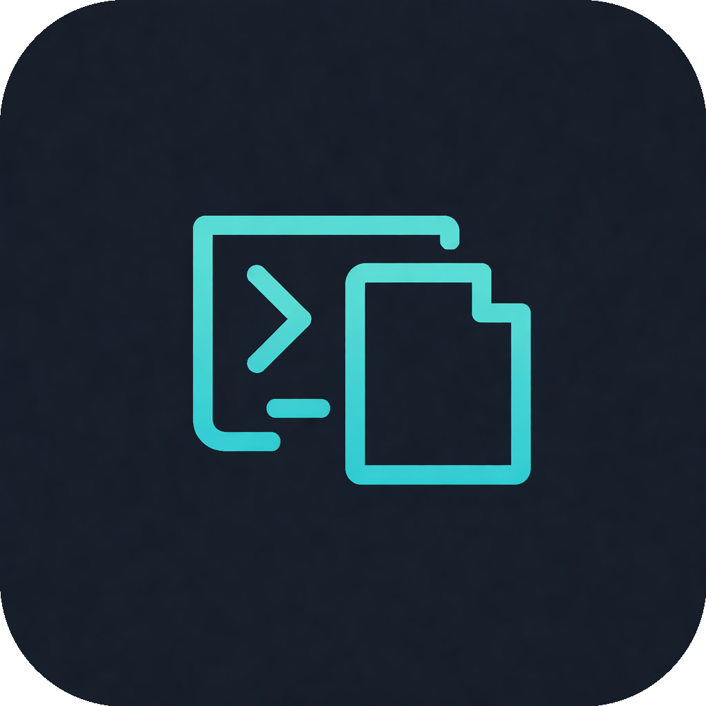

<p align="center">
  
</p>

<h1 align="center">copycmd</h1>

<p align="center">Automatically detects commands in terminal output and adds a clickable <code> copy </code> button next to each one. Click it, and the command is copied to your clipboard.</p>

<p align="center">Works with <strong>everything</strong> — claude, cat, npm, curl, any program. No prefixes, no wrappers, just use your terminal normally.</p>

## How it works

copycmd is a lightweight PTY proxy that sits between your terminal emulator and your shell. Every program still sees a real TTY (so nothing breaks — not even TUI apps), but the output stream is scanned for recognizable commands and a clickable ` copy ` button is injected inline.

```
$ cat README.md
To get started:
  npm install --save-dev typescript  ┃ copy ┃    ← Cmd+click to copy
  git clone https://github.com/foo/bar.git  ┃ copy ┃

Regular text has no button.
```

When you Cmd+click ` copy `, the command is copied to your clipboard and you get a macOS notification confirming it.

## Requirements

- macOS (for the URL scheme handler — the proxy itself is cross-platform Python)
- Python 3 (pre-installed on macOS)
- A terminal with OSC 8 hyperlink support:
  - **Ghostty** ✓
  - **iTerm2** ✓ (3.1+)
  - **Kitty** ✓
  - **WezTerm** ✓
  - **Alacritty** ✓ (0.11+)
  - **macOS Terminal.app** ✗ (buttons show but aren't clickable)

## Installation

```bash
git clone https://github.com/shyamkhakharia/copycmd.git
cd copycmd
./install.sh
```

The installer will:

1. Copy the PTY proxy to `~/.copycmd/`
2. Build and register the `CopyCmd.app` URL scheme handler (for click-to-copy)
3. Add `command = ~/.copycmd/copycmd-proxy.py` to your Ghostty config

Then **restart Ghostty** — that's it.

### Manual setup (other terminals)

For non-Ghostty terminals, configure your terminal to run the proxy as its shell/command:

**iTerm2:** Preferences → Profiles → General → Command → `~/.copycmd/copycmd-proxy.py`

**Kitty:** Add to `kitty.conf`:
```
shell ~/.copycmd/copycmd-proxy.py
```

**WezTerm:** Add to `wezterm.lua`:
```lua
config.default_prog = { os.getenv("HOME") .. "/.copycmd/copycmd-proxy.py" }
```

## What it detects

- **Package managers**: `npm install`, `yarn add`, `pip install`, `brew install`, `cargo install`, `apt-get install`, etc.
- **Git**: `git clone`, `git checkout`, `git push`, `git pull`, `git stash`, etc.
- **CLI tools**: `curl`, `wget`, `docker run`, `kubectl`, `terraform`, `rsync`, `scp`, etc.
- **Shell operations**: `export`, `source`, `sudo`, `mkdir -p`, `chmod`, etc.
- **Backtick-wrapped commands**: `` `brew install node` `` in output text

## TUI apps

TUI programs (vim, claude, htop, etc.) are automatically detected via alt-screen buffer switching and cursor movement escape sequences. When a TUI is active, copycmd passes output through unmodified — no interference.

## How the URL handler works

The installer builds a minimal macOS app (`~/.copycmd/CopyCmd.app`) using AppleScript that:

1. Registers the `copycmd://` URL scheme with macOS Launch Services
2. When a `copycmd://` URL is opened (by Cmd+clicking ` copy `), it decodes the base64 payload
3. Copies the decoded command to your clipboard
4. Shows a macOS notification confirming the copy

The app runs as a background-only process (no Dock icon).

## Uninstalling

```bash
# Remove Ghostty config line (delete the copycmd lines)
# Remove installed files
rm -rf ~/.copycmd
```

## License

MIT
